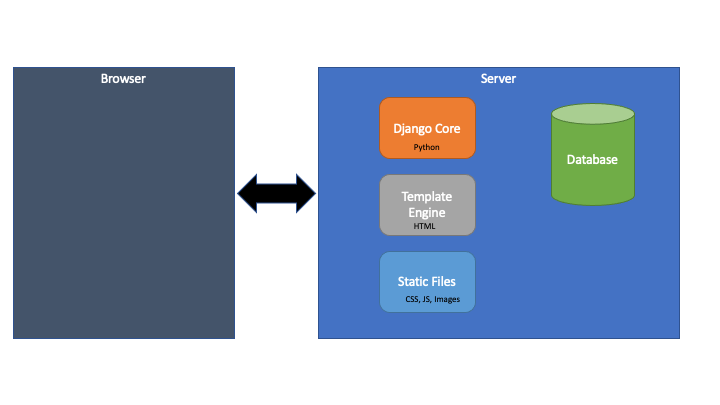
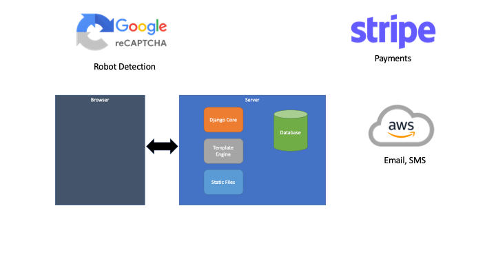
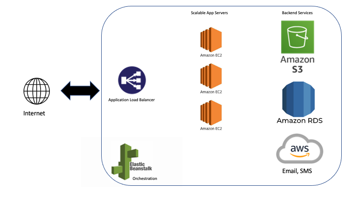

:orphan:

.. image:: ../images/cobalt.jpg
 :width: 300
 :alt: Cobalt Chemical Symbol

===============
Design Overview
===============

Cobalt is built using vanilla Django. Where possible we try to follow the path of least resistance by using
defaults or common packages and approaches. The one main difference here is with HTMX which is described below.
While this is currently an anti-pattern, we do not believe that this will be the case for long and Django-HTMX will
come to be the most common way of building applications such as this.

************************
High Level System Design
************************

Basic
=====

This shows the basic architecture of Cobalt, which is typical for a Django application.

Interfaces
===========

This includes the external interfaces.

AWS
===

This diagram shows the high level architecture of Cobalt as deployed on AWS for the ABF.

This represents a single system, for the ABF we have Test, UAT and Production.

****************
Key Technologies
****************

Every time we add a technology to Cobalt we introduce another dependency and another thing that can go wrong.

Every time we build functionality in Cobalt that could have been implemented using a third party tool,
we increase the complexity of Cobalt unnecessarily.

This requires a level of balance.

Rules for Adding to the Technology Stack
========================================

- It must be easier to learn the new technology stack than to build functionality ourselves.
- It must be well supported and widely used.
- It should do a single, well defined thing.
- It must never be added just because it is “cool” or looks good on a resume.
- All client side libraries (with few exceptions) must be part of the code base.
- All server side libraries must be installed with pip.
- It must be added to this document.

Current Server-side Approved Technology Stack
==============================================

=======================             =============================       ========================================================
Technology                          Version                             Purpose
=======================             =============================       ========================================================
Python                              3.7 (dictated by AWS)               Core development language
Postgres                            12 (dictated by AWS)                Main database
django                              3.2.5                               Web framework
pytz                                2019.3                              Timezone utilities
requests                            2.20.1                              URL access (used by other packages as well)
stripe                              2.43.0                              Stripe API
Pillow                              8.2.0                               Image manipulation
psycopg2-binary                     2.8                                 Access to postgres
django-summernote                   0.8.11.6                            Wrapper for Summernote WYSIWYG
django-crispy-forms                 1.9.0                               Form generation (*Deprecated*)
django-widget-tweaks                1.4.8                               Form manipulation (*Deprecated*)
django-extensions                   2.2.9                               Standard utilities
boto3                               1.12.39                             AWS API
botocore                            1.15.39                             AWS API
geopy                               2.0.0                               Lat and Lon finder
essential-generators                0.9.2                               Generating test data
=======================             =============================       ========================================================

Current Server-side Banned Technology Stack
===========================================

=======================             =============================       =======================================================================
Technology                          Version                             Purpose
=======================             =============================       =======================================================================
django-rest-framework               Build APIs in Django                DRF is excellent technology but we don’t currently have a need for it.
celery                              asynchronous task management        Too complicated for our needs. Use simple threads or cron instead.
=======================             =============================       =======================================================================

Current Client-side Approved Technology Stack
=============================================

==========================          =============================       =======================================================================
Technology                          Version                             Purpose
==========================          =============================       =======================================================================
Creative Tim Dashboard Pro          2.1.0                               We bought a licence for this as a starter template
Bootstrap 4                         4.0.0                               CSS
JQuery                              3.4.1                               Easier Javascript code
Summernote                          0.8.16                              WYSIWYG editor
animate                             4.0.0                               Web animation
data tables                         1.10.25                             Client side table manipulation
HTMX                                Latest                              Client updates
==========================          =============================       =======================================================================

**Do not use any other significant client side code, e.g. React or Angular without proper discussion.**

One-off use of JS libraries for specific pages is fine.

HTMX
====

Intro
-----

Cobalt is a Django application so much of the design is already dictated.
We originally discussed having an API for most functions which would
suggest using Django Rest Framework (DRF) with a front end such as React.
It became clear early on that the API would be a very small part of
Cobalt and could be added later without compromising the overall design.

Django’s strongest benefit is the ability to generate a fully
functional application from the models, views and templates with
little client side code required. In fact, Django offers nothing
for the client side and leaves you to your own devices there.
The “standard” best practice is to build any required client
code in JavaScript or a JavaScript framework and to connect
that to the backend through Ajax with Post and JSON. This is wrong.

We started developing this way but realised (a little too late!)
that this is a bad approach with Django. Why?

Django is built to generate HTML and it is very good at it.
It is easy to buy the argument that separating presentation
from content is a good thing and therefore having the backend
generate the data and send it to the front end as JSON makes
sense, however if you aren’t sending all of the data, just
changes to the front end then this gets messy quickly. Also
Django already handles the separation of content from presentation
with its templates.

History
-------

Using the original best practice approach we ended up with
three types of screen. We had pure Django screens that did
something specific and moved on. These screens worked perfectly.
Then we had screens that needed to interact with the user
before they moved on. For example adding users to groups or
entering events and needing to get the names of all of the team
mates. These are a bit like Single Page Applications (SPAs)
and building them in React with DRF was considered, however
there aren’t really enough of them and then React and DRF
would be required to work on Cobalt, making it more complex
and therefore more expensive to support.

The two solutions that we came up with were very different.
For low use screens we just have the whole screen refresh
which requires less code but still has a bunch of JavaScript
and gives the user a rather ugly, jerky experience.

For screens with high use, we can’t have the jerkiness so we
use JavaScript and JSON with backend Django code. The
event entry screen was built this way and quickly became the
worst screen in Cobalt and the hardest to support.

A Better Option
---------------

Starting with the Club Menu screens we introduced HTMX
(https://htmx.org) to Cobalt. HTMX makes it easier to update
screen elements without needing to write JavaScript. However,
HTMX isn't really the main point. The main point is that
we should use Django to generate HTML and to insert that
directly into the page without needing to worry about JSON
and JavaScript. HTMX is the implementation, the design part
is preferring HTML over JSON (although to give HTMX the
credit it deserves, I doubt we would have thought of it
without coming across HTMX).

If you use JSON then you end up with loads of
plumbing code, mostly on the client side but also within your
Django views. With HTMX that disappears.

In Practice
-----------

It is not a completely fair comparison but it does give some
insight into the difference if we compare the original
generic user search with the HTMX version. This is used
anywhere in the application where we want to look up a user
to incorporate in a form on a page. The original version is
in Javascript and the HTMX version is in, well... HTMX.

THe original version is 794 lines of code, 638 of which are
client side (a combination of HTML and JavaScript). It took
about 3 days to build.

The HTMX version is 283 lines of code, 62 lines of which are
the client side HTML. It took 4 hours to build (obviously
quicker as code from the original version was re-used).

Design Approach
---------------

The biggest advance of using HTMX is how modular and easy
to maintain the code becomes. Take the example of a page
that has some general information and a list of users with the
option to add or delete a user (a common pattern). With
HTMX this can be built as:

* **view.page.py** - gets data from model and renders the template on the next line
* **templates.page.html** - inserts data from the view and includes a div with the list
* **templates.list.htmx** - formatted list div with data passed through from view.page.py

This gives us a nice static page, but we still need to handle add and delete.
We can do this by having HTMX make an ajax call when a button is clicked
and having that replace the div with the list in.

So back on the server side we have:

* **view.delete_htmx.py** - deletes the user and returns the same list template as above (templates.list.htmx)
* **view.add_htmx.py** - adds a user and returns the same list template as above (templates.list.htmx)

HTMX on the client side just calls this and replaces the list div with what is
returned. It is very simple to support and very smooth for the user.

Tips
----

Avoid loading JavaScript in an HTMX page that gets incorporated in
an existing page. The results can be variable. Better to load
static functions in the initial page and call them from the loaded
page.