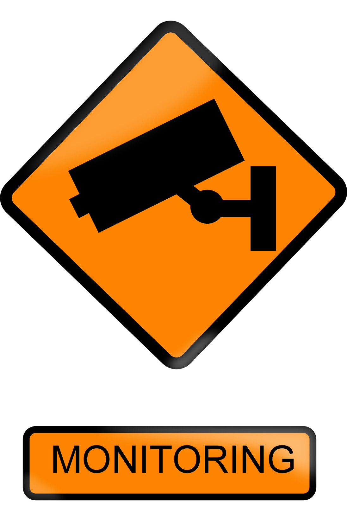

:orphan:

.. image:: ../../images/cobalt.jpg
 :width: 300
 :alt: Cobalt Chemical Symbol

Monitoring Overview
===================

For the most part, monitoring is not really within the scope of this documentation.
However, as some aspects of monitoring are part of the code base, it is covered here.

Components
----------

The following are part of the monitoring suite:

- Django monitoring - Django is set to email us for every 5xx error. These are errors that were not handled cleanly by the code.
- AWS - you can subscribe to AWS events and be emailed about the health of the system.
- Client-side errors - There is still some residual code to pass client-side errors back to Cobalt. Common errors are currently commented out but can be re-instated.
- New Relic - we use New Relic to monitor the ABF version of the system. We have both APM (Server side) and Browser (client side) monitoring. To use this you need to set up a configuration file per instance (Test, UAT, Production, etc). This file can be generated from New Relic and is not part of the source code. You can find the reference to this file in the cobalt/wsgi.py file.For the Browser monitoring you need to set an environment variable called NEW_RELIC_APP_ID.
