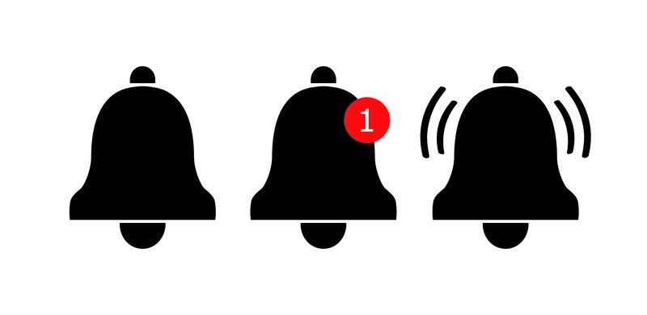
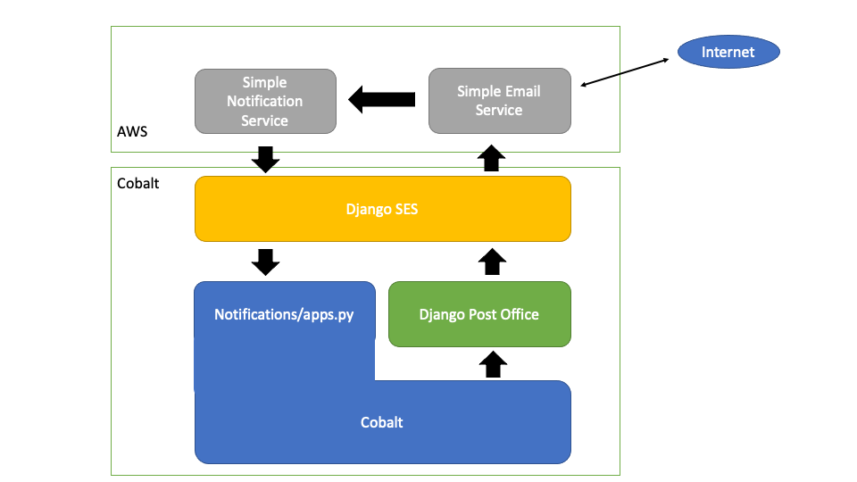

:orphan:

.. image:: ../../images/cobalt.jpg
 :width: 300
 :alt: Cobalt Chemical Symbol

.. note::
   This documentation needs a refresh. The email part needs
   updated with examples and the rest needs to be tighter.

:doc:`../how_to/using_references`

===========================
Notifications Application
===========================

.. note::
    This page has the documentation on how to use this application
    (externally provided APIs etc). If you are looking for
    information on how it works internally, you can find that in :doc:`./notifications_support`.

**************
Module Purpose
**************

Notifications handles user communications from within Cobalt. All interaction with
users that do not go through a screen or an API should go through Notifications.

**************
External Usage
**************

Notifications is the communication centre of Cobalt. It is how all other modules
communicate with members and is also a notice board for events (as in actions, not
bridge events!) that members may want to subscribe to be notified about.

There are many events that a Cobalt user may wish to be notified about.
For example, they may want to hear when a new post is added to a particular
forum, or when someone replies to a comment that they have made in a forum.
They may wish to be notified when the results become available for an event
they have played in, or when a congress in their area is announced.

A user may have different preferences for how they are notified as well.
One user may want SMS, another email and yet another may only wish to find
out when they visit the website. Of course, some users may not want to be
notified at all and others will want a combination of methods depending upon
what it is they are being notified about.

Notification Types
==================

There are five broad categories of notification:

System Broadcasts (*Not yet implemented*)
  Users will receive these regardless of preference. These are rare.
Broadcasts (*Not yet implemented*)
  These are typically emails from the National Body, Clubs, State
  Bodies etc. Users may opt out of these through their settings.
Named Specific (*Not yet implemented*)
   The calling module will provide a list of names. Users can
   choose how they are notified or choose to opt out. For example, Results tells
   Notifications that the results for an event are available and who played in the
   event. Notifications passes this information on to the member (or not, if the
   member opts out).
Happenings
  These are things that members choose to listen to. For example,
  a new Forum post.
Personal
  These are messages intended for a single recipient.

Notification Methods
====================

- **In App Notifications** - these are always provided. The user will see this when
  they log in to Cobalt.
- **Email** - HTML format emails.
- **SMS** - Short messages, often with links to pages within Cobalt.

User Experience
===============

Users always see notifications on the top right hand of the screen. They can
acknowledge a notification by clicking on them. Notifications should come with a
link that takes the user to the right relative URL for more information.

In addition to the In App Notification, users can also receive notifications
over email or SMS.

Creating Immediate Notifications
================================

You can create a notification for a user directly by calling
:func:`notifications.views.core.contact_member`. You need to provide the member,
message and type (SMS or Email) as a minimum.

This is the recommended way of communicating
with a member if you want standard notifications as this will also create
an internal notification message.

If you don't want the internal notification then you can call the sending
functions directly.

* :func:`notifications.views.core.send_cobalt_email_with_template` - sends an email, using a template (Recommended).
* :func:`notifications.views.core.send_cobalt_email_preformatted` - sends an email that is already formatted (old).
* :func:`notifications.views.core.send_cobalt_sms` - sends an sms.

It is recommended that you do this rather than sending messages directly
so we can have a single point to maintain.

Creating User Listens
=====================

Sometimes you don't want to immediately notify a user but you do want to
set them up for later notifications. For example, if a user posts an
article in a Forum, they may want to be notified when someone comments on it.

In this case you should call :func:`notifications.views.listeners.create_user_notification`.

This will set up a rule to listen for the events that you request. If you no
longer want this (for example, if the post is deleted), then you should call
:func:`notifications.views.listeners.remove_listener`.

Event Types
-----------

The applications control their own event types, but the format of the string
used to identify them should follow a standard:

<application>.<function>.<action>

If necessary more levels can be added.

For example:

* forums.post.comment.new - *a comment has been added to a post*
* forums.post.delete - *a post has been deleted*

Notification of Events
======================

When something has happened in an application that a user **could** be
interested in, then notifications should be informed. It is better to
over communicate than to under communicate, but always expect to also have
to update the code within notifications as it isn't magic.

To announce an event has occurred call
:func:`notifications.views.listeners.notify_happening`.

This is the point at which if a member has registered to find out about
an event, then they will be notified.

Email
=====

Email is a core function of Cobalt. We use email as our main method of communication.
Django can send emails through SMTP to any compliant email gateway. The Django email
backend is also swappable.

We use two packages to help us with this:

* **Django Post-Office** (https://pypi.org/project/django-post-office/) installs as a replacement email backend and handles secure delivery and bulk emails. It actually uses any other email backend to do the sending so you can use this without relying on AWS SES.
* **Django SES** (https://github.com/django-ses/django-ses) is a replacement email backend that tightly integrates with SES. You can send emails using SES simply through SMTP but Django SES can also receive status updates.

When Cobalt sends an email it goes through Django Post Office which actually uses Django SES to
do the sending. Django Post Office handles templates and queuing as well as general orchestration
of emails. Django SES uses BOTO3 rather than SMTP which is more efficient.

After that AWS SES is responsible for sending the email. SES notifies Simple Notification
Service (SNS) when a message changes state and that in turn notifies us through Django SES.

Django SES emits signals for the events that it receives which we pick up through apps.py.
See :func:`notifications.apps.NotificationsConfig`.

This updates the Snooper model: :func:`notifications.models.Snooper` which has a one-to-one
relationship with the Django Post Office Email object.

Use Cases
---------

The following things are email use cases:

- Send an email that is already formatted
- Send an email using a Django Post Office template
- Send a single email to a single person
- Send a single email to multiple people (Using BCC)
- Send a similar email to multiple people (Using context. e.g. 'name": etc)
- Send an email by putting it on a queue to send shortly
- Send an email immediately
- Allow only Global email admins to see the email
- Allow specific RBAC groups to see the email (e.g. Club admins for a specific club)
- Provide a reply_to field so that users can reply
- In addition to sending the email, you may also wish to add a user notification to the screen

Behaviours
----------

Some emails can be generated by Django itself, but all emails that we create have the following properties:

- Every email has a Django Post Office email record and a Snooper record
- Every email has a "playpen" check to only send to a real email address from the production system
- By default emails are queued for sending but this can be overridden
- By default emails can only be viewed by Global email admins but this can also be overridden

.. _notification_apis_label:

APIs
====

Email
----------------
:func:`~notifications.views.core.create_rbac_batch_id`
    This is optional, but if you want anyone other than admins to be able to see the emails that you send then
    you need to provide an RBAC batch id with the email request. This function will create one for you.

    The `rbac_role` is used to control who can see these messages.

.. code-block::

    from notifications.views.core import create_rbac_batch_id

    >>> batch_id = create_rbac_batch_id(
                 rbac_role=f"notifications.orgcomms.{club.id}.edit",
                 user=me,
                 organisation=club,
                 )
    >>> batch_id
    <BatchID: ZdPG-iMHT-mI5q>

:func:`~notifications.views.core.send_cobalt_email_with_template`
    Send an email using a template. Perhaps a bit of a misleading name as it will use the default template if none
    is supplied.

.. code-block::

    from notifications.views.core import send_cobalt_email_with_template

    context = {
        "name": member.first_name,
        "title": "Tomorrow is Friday",
        "email_body": "<h1>Reminder</h1>
Tomorrow is not Thursday
",
        "box_colour": "primary",
    }

    send_cobalt_email_with_template(
        to_address=member.email, context=context, priority="now", batch_id=batch_id
    )

:func:`~notifications.views.core.send_cobalt_bulk_email`

.. admonition:: Deprecated

    This is not used.

Send a message to multiple people, with no customisation.

:func:`~notifications.views.core.send_cobalt_email_preformatted`
    Sends an email that has already been formatted. Doesn't use a template.
:func:`~notifications.views.core.send_cobalt_email_to_system_number`
    Send a simple message to a user or UnregisteredUser.

Messaging
---------

:func:`~notifications.views.core.send_cobalt_sms`
    Send an SMS to a user.
:func:`~notifications.views.core.send_fcm_message`
    Send a Google FCM message to a user.
:func:`~notifications.views.core.send_cobalt_bulk_notifications`
    Send SMS to multiple recipients.

General
-------
:func:`~notifications.views.core.add_in_app_notification`
    Adds an in-app notification for a user.
:func:`~notifications.views.core.contact_member`
    Contact a member over SMS or email (deprecated).
:func:`~notifications.views.listeners.add_listener`
    Add a listener for an event.

Forms
-----
:func:`~notifications.views.core.email_contact`
    Form to contact an individual