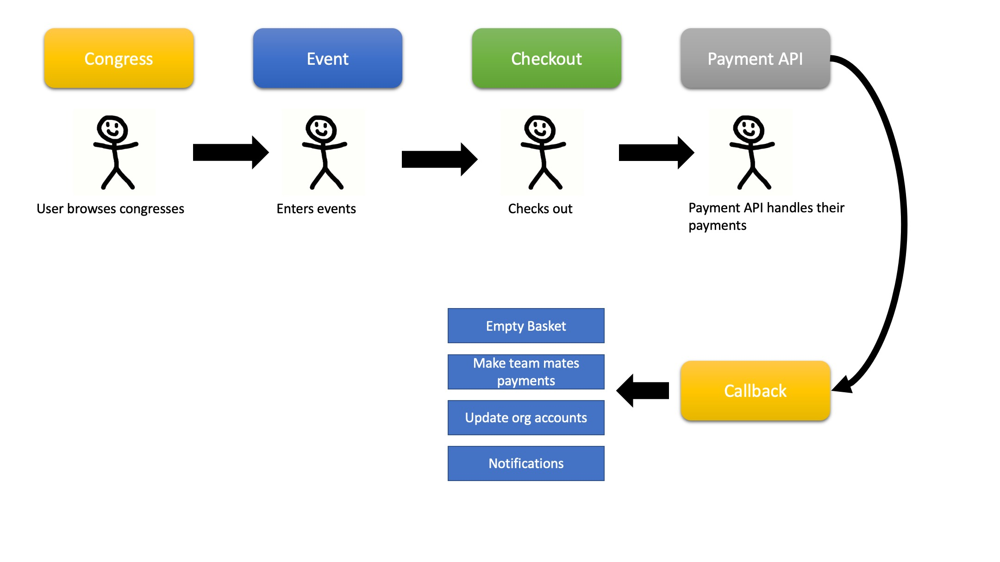

.. _events-overview:

.. image:: images/cobalt.jpg
 :width: 300
 :alt: Cobalt Chemical Symbol

Events Overview
=================

Events handles anything related to creating, managing and entering a bridge
event.

Modules
=======

Payments code lives in standard Django Python files - Models, Views, Forms,
Templates etc. In addition the more backend functions that do not deal with
users are stored in core.py. There is also some code included in the Models.py
for Events. The two main areas to do the bulk of the work
within Events are views.py and core.py. The description below does not
differentiate between the location of a function.

Relationships
=============

Congress elements are defined as follows:

* **CongressMaster** - represents the series of congresses, basically the
  congress without the year and the details. These are linked to an organisation
  which is how security is controlled (at the organisation level).
* **Congress** - a congress is a specific concrete instance underneath CongressMaster.
  Congresses have a lot of data associated with them. Only congresses with a
  status of "Published" can be seen by normal users.
* **Event** - congresses must have events for people to play in.
* **Session** - Events must have at least one session.

Entries are linked to the congress structure as follows:

* **EventEntry** - this connects to Event and represents a team, individual or
  pair who are playing in an Event within a Congress.
* **EventEntryPlayer** - players who form part of an EventEntry.
* **BasketItem** - a collection of one or more EventEntries created by a player
  who has not yet checked out. BasketItems are deleted once the checkout process
  has been completed.

Flow
====

Users view congresses and can choose to enter events. They may checkout after
entering one event or build up a collection of events in their basket. There
are three ways that a user can pay for an event. They can use their own system
dollars to pay for themselves or team mates. If they have permission then they
can use a team mates system dollars to pay for that person only. Finally, if
the congress supports it then they pay using off-system methods such as
bank transfers or cheques. These are handled by the convener.

When a user checks out they are given a summary of what they are committing to
and they are taken to the payment_api which handles the detail of collecting
the funds. The EventEntryPlayer records are flagged for payment and if the
payment succeeds then the entries are marked as paid. At this point any
EventEntryPlayer records associated with this entry which are marked for payment
with a team mate's system dollars are also processed and all team mates are
notified. Individual payment records per user are entered into the account of
the organisation associated with the congress.

If a player either does not make the payment or the payment fails then the
items remain in their basket and no other payments are processed.
