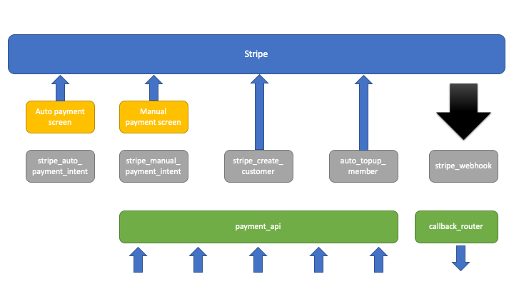

.. _payments-overview:

.. image:: images/cobalt.jpg
 :width: 300
 :alt: Cobalt Chemical Symbol

.. image:: images/heavy-dollar-sign.png
  :width: 200
  :alt: Cobalt Dollar Symbol

Payments Overview
=================

Payments handles anything related to money within Cobalt. It is used by the
other modules to facilitate and track payments and as such is primarily an
internal service function, however it also has some interaction directly with
users to view statements and manage auto tops as well as member-to-member
transfers.

Modules
=======

Payments code lives in standard Django Python files - Models, Views, Forms,
Templates etc. In addition the more backend functions that do not deal with
users are stored in core.py. The two main areas to do the bulk of the work
within Payments are views.py and core.py. The description below does not
differentiate between the location of a function.

Functions
=========

Internal - Member
-----------------

The internal functions work as standard Django view functions. They work with
the models to handle data updates. There are three broad categories of functions:
Member (relating to members), Organisation (relating to Organisations) and
Admin (for administrators).

* :func:`payments.core.auto_topup_member` - processes an auto top up for a
  member.
* :func:`payments.views.setup_autotopup` - view for a user to sign up for auto
  top up.
* :func:`payments.core.get_balance` - get member's balance.
* :func:`payments.core.get_balance_detail` - get details of member's balance.
* :func:`payments.core.update_account` - registers transaction against member
  account.
* :func:`payments.core.update_organisation` - registers transaction against an
  organisations account.
* :func:`payments.views.update_auto_amount` - Ajax call to update member top
  up amount.
* :func:`payments.views.member_transfer` - transfer money to another member.
* :func:`payments.views.statement` - show member's statement.
* :func:`payments.views.statement_csv` - show member's statement as CSV.
* :func:`payments.views.statement_common` - common code across all statements.
* :func:`payments.views.manual_topup` - manually add to account.
* :func:`payments.views.cancel_auto_top_up` - turn off Auto Top Up.
* :func:`payments.views.stripe_webpage_confirm` - called by the webpage when
  Stripe has notified the user of successful one off payment. We do not trust
  the client, but update the status in case of Stripe problems. Usually the
  webhook will have been called before this gets called so it will do nothing.
* :func:`payments.views.stripe_autotopup_confirm` - called by the webpage when
  Stripe has notified the user of successful card registration. We do not trust
  the client, but update the status in case of Stripe problems. Usually the
  webhook will have been called before this gets called so it will do nothing.
* :func:`payments.views.stripe_autotopup_off` - called by the webpage just before
  registering new card details. Required to track status.

Internal - Organisations
------------------------

* :func:`payments.views.statement_org` - shows an organisation's statement.
* :func:`payments.views.statement_csv_org` - downloads an organisation's statement.
* :func:`payments.views.statement_org_summary_ajax` - called by the web page
  when the summary date range changes to update the summary amounts.

Internal - Admin
----------------

* :func:`payments.views.statement_admin_summary` - main page for admins.
* :func:`payments.views.statement_admin_view` - wrapper for viewing member
  statements by admins. Accepts member_id as paramter.
* :func:`payments.views.settlement` - view to make settlements to clubs
* :func:`payments.views.manual_adjust_member` - adjust member balance
* :func:`payments.views.manual_adjust_org` - adjust org balance

Stripe
------

The Stripe functions interact with the Stripe payments platform to perform
external activities.

* :func:`payments.core.stripe_manual_payment_intent` - informs Stripe that a
  member may be going to make a manual payment.
* :func:`payments.core.stripe_auto_payment_intent` - informs Stripe that a
  member may be going to register a credit card.
* :func:`payments.views.stripe_create_customer` - creates a new customer in
  Stripe and records the customer number against the member.
* :func:`payments.core.stripe_webhook` - this is the method for Stripe to
  contact us. Can be for a number reasons. Calls one of the next two functions.
* :func:`payments.core.stripe_webhook_manual` - handles one off transactions.
* :func:`payments.core.stripe_webhook_autosetup` - handles auto top up set up.

API
---

These functions allow the other applications in Cobalt to interact with Payments.

* :func:`payments.core.payment_api` - main entry point to make a payment happen.
* :func:`payments.core.callback_router` - this is the exit point from payments to
  return information when an asynchronous event has happened, such as payment
  being made.
